# OSGi Tutorial

### 1.Clone my github repository:

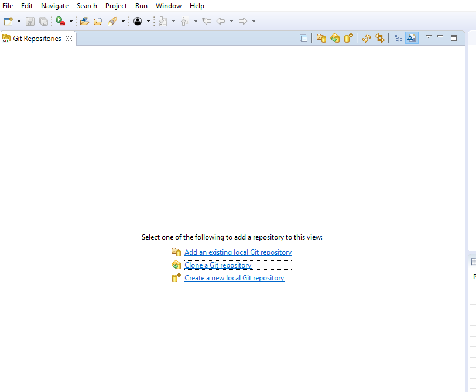

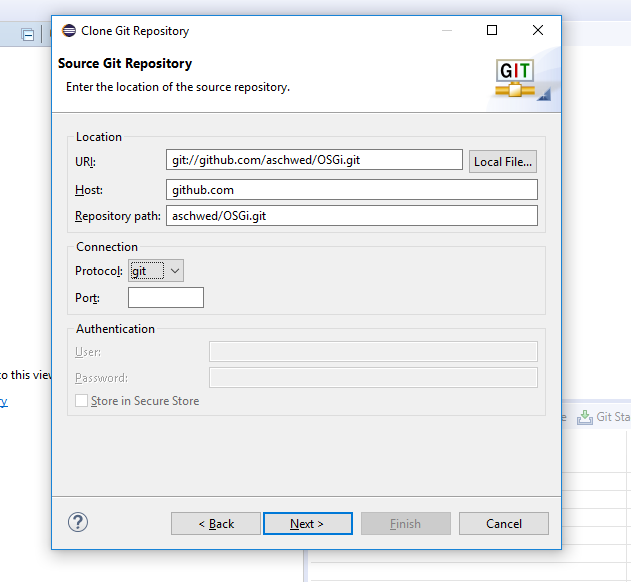


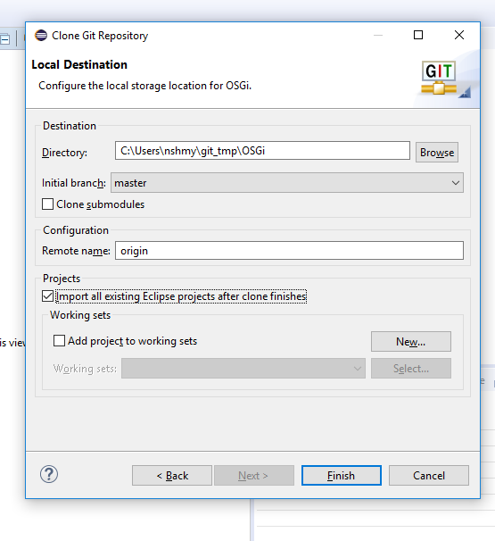

### 2.Set a target platform
### OSGI_table_gui->Open file OsgiTargetDefinition.target->Set as active target platform (upper right corner)
Specific OSGi bundles such as Equinox console are available now and will start together with user defined bundles.


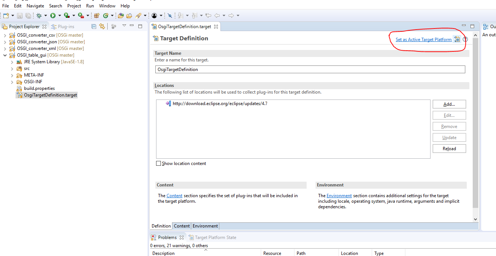

### Reload the target platform

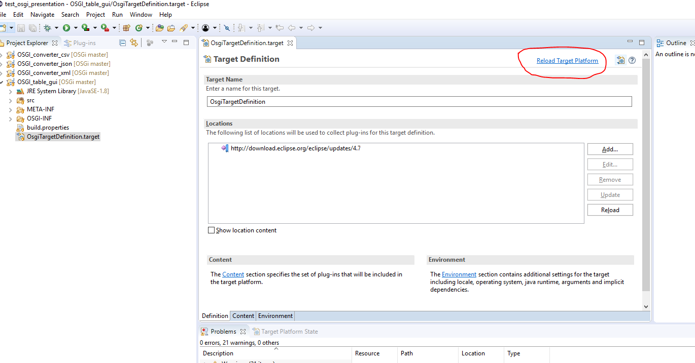

### 3.Run the project
Select Run as the OSGi framework option.


Here you can see the UI containing a sample data table, a dropdown menu with available formats and a convert button. You can choose a format and convert the data.
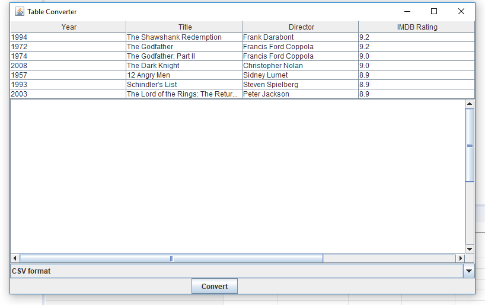

### 4. Create a new bundle

Now we are going to extend functionality and add a new module to convert the data to markdown. All we need to do is to create a new project (which is also an OSGi bundle), to define dependencies and provide the bundle as a service component.


Be sure to run your plug-in with an OSGi framework (Equinox).

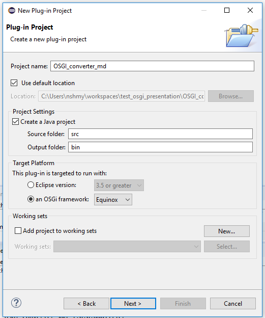

### 5. Configure the MANIFEST.md file
Select the dependencies tab, click the add button in the imported packages section, add imported packages (select org.dhbw.se.table.api)
Save!

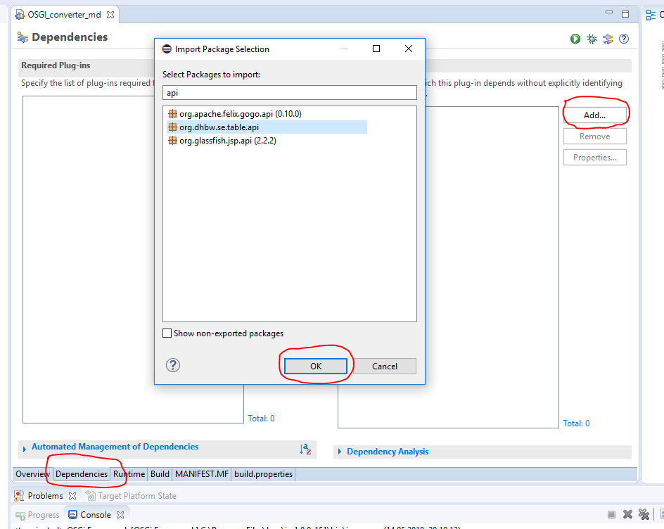

### 6. Create new class
Next you need to create the implementation class. You don't need to write code, just copy it.:)


```java
package demo;

import java.util.List;

import org.dhbw.se.table.api.Movie;
import org.dhbw.se.table.api.MovieListConverter;

public class MDConverter implements MovieListConverter {

	@Override
	public String getFormatDescription() {
		return "Markdown format";
	}

	@Override
	public String getConvertedContent(List<Movie> movies) {
		StringBuffer buffer = new StringBuffer();
		buffer.append("Year | Title | Director | Rating\n");
		buffer.append("---- | ---- | -------  | ---- \n");
		for (Movie movie : movies) {
			buffer.append(movie.getYear());
			buffer.append(" | ");
			buffer.append(movie.getTitle());
			buffer.append(" | ");
			buffer.append(movie.getDirector());
			buffer.append(" | ");
			buffer.append(movie.getImdbRating());
			buffer.append("\n");
		}
		return buffer.toString();
	}

	@Override
	public String toString() {
		return getFormatDescription();
	}
}


```


### 7. Define the service layer
Create the OSGI-INF folder in your project.
Create a component definition file and place it into the OSGI-ING folder.
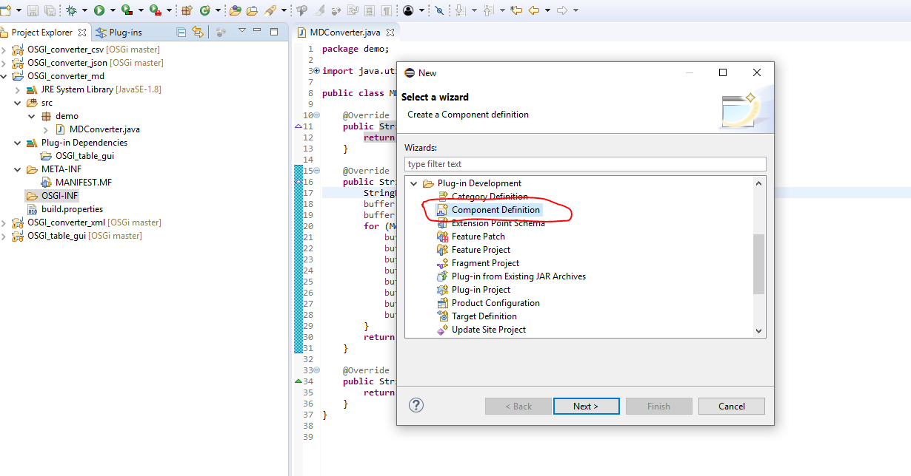
New->Plug-in development->Component Definition

Choose the implementation class as well.


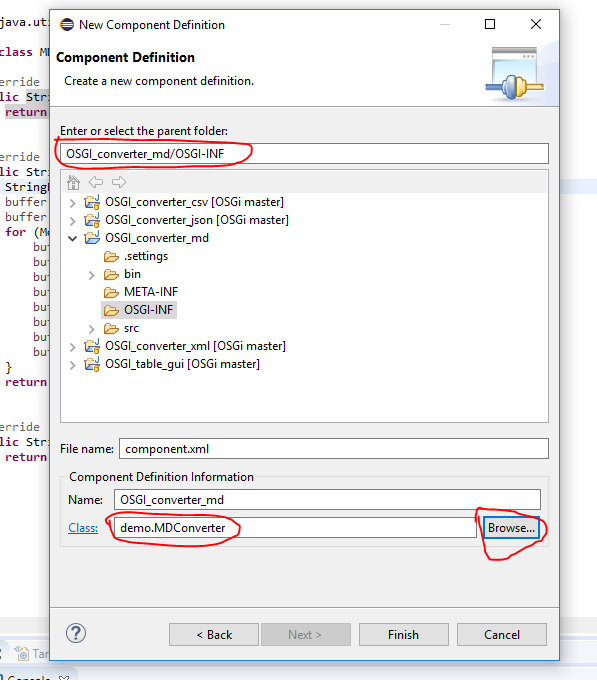

### 8. Declare services
To declare a service choose the service tab, click the Add button and select the MovieListConverter interface. Now the markdown converter service can be registered, and an instance of the class will be created.
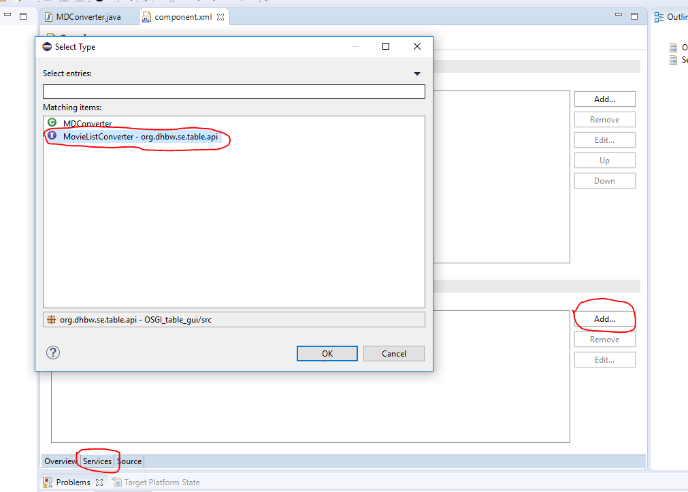

### 9. Run the application again and see what happens next

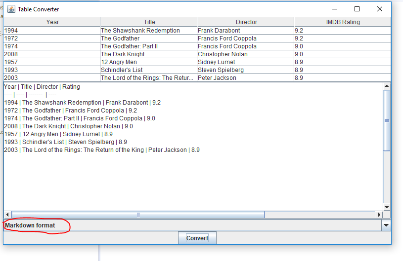

### 10. Now you can use the OSGi consoleand control your bundles dynamically.
Use the following commands: ss, bundle<id>, start bundle <id>, stop bundle <id>


